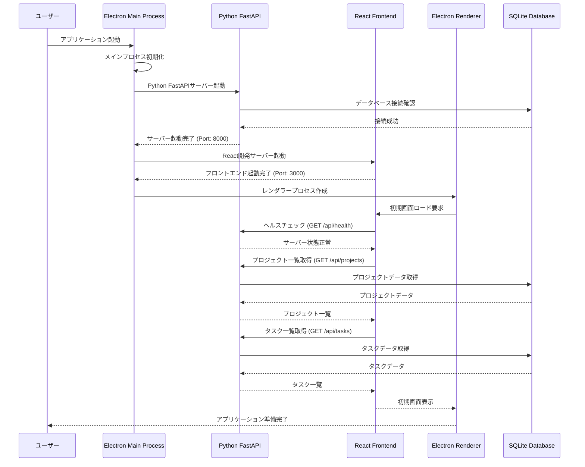
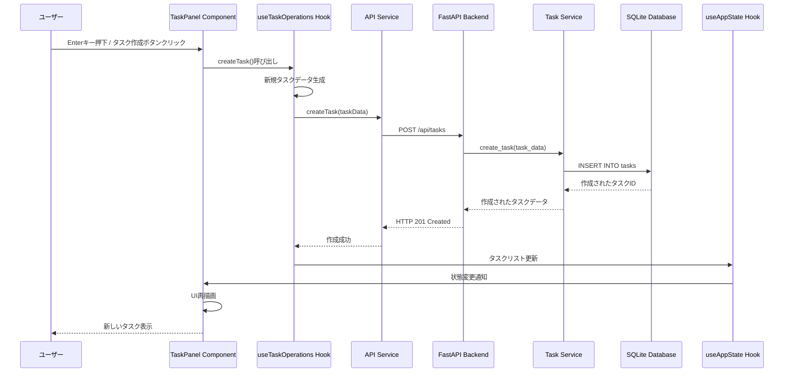
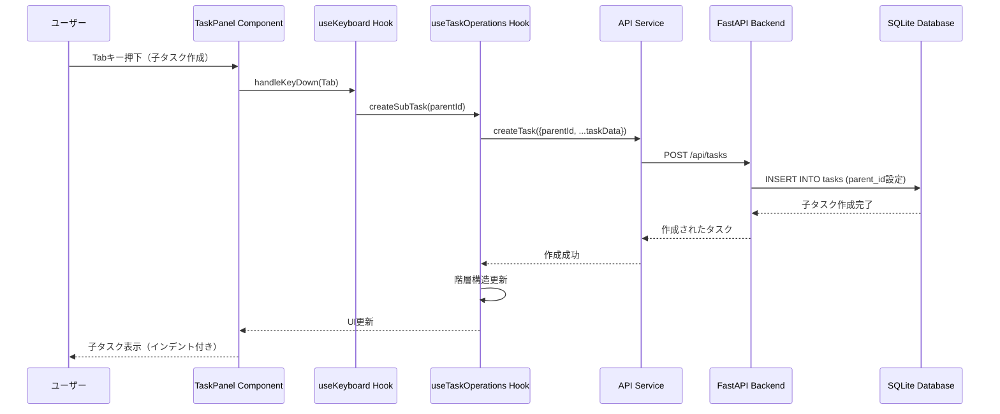
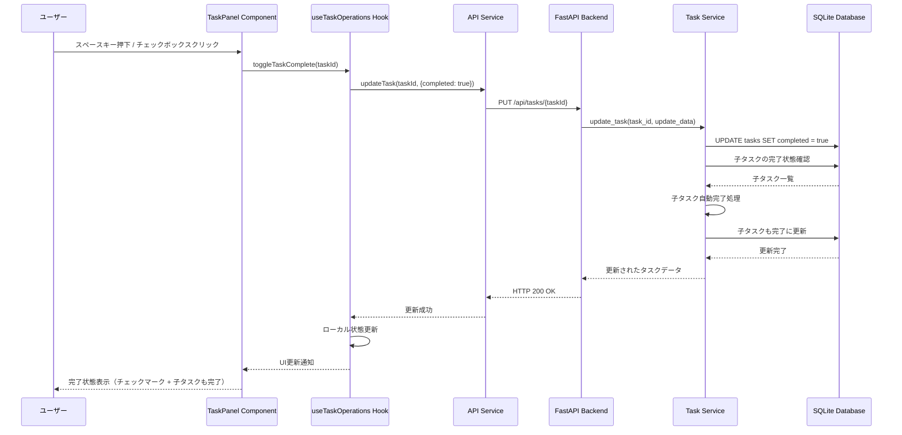
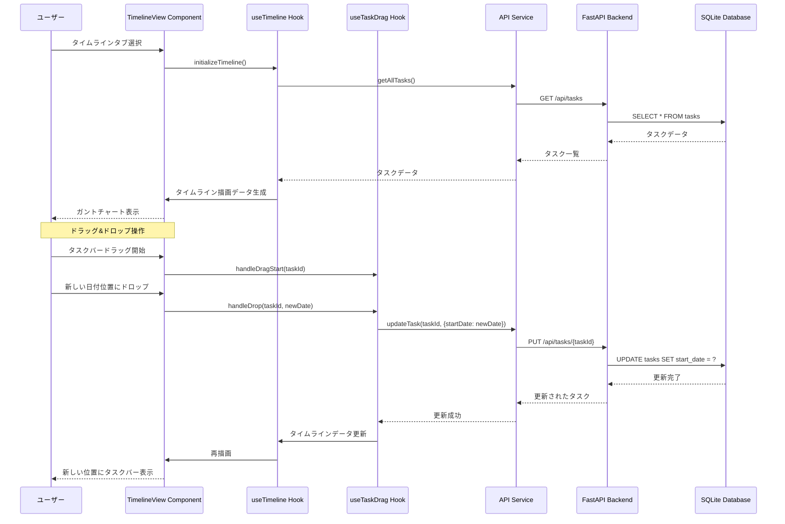
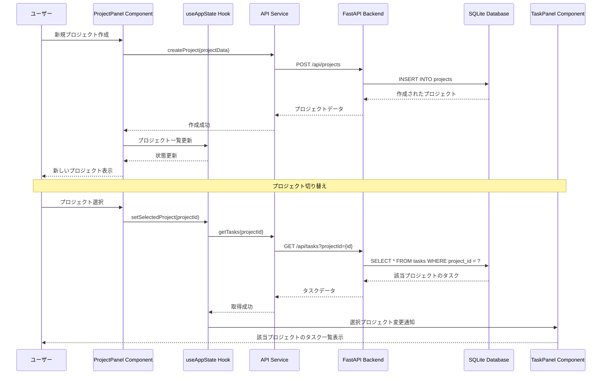
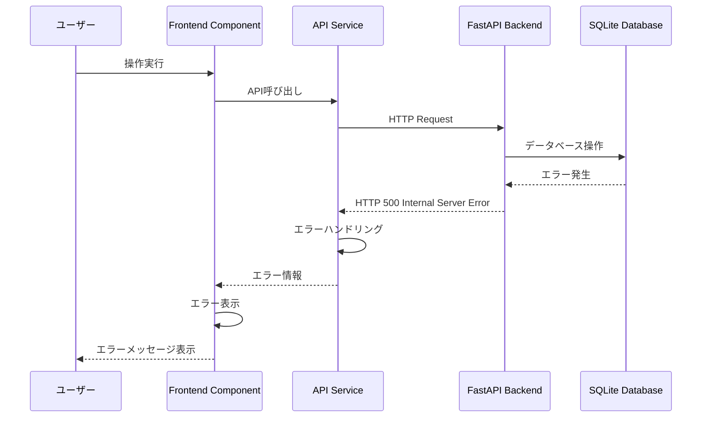

# 処理シーケンス図

このファイルは階層型ToDoリストアプリケーションの主要な処理フローをmermaid記法のシーケンス図で示しています。

## 1. アプリケーション起動シーケンスcd

## 2. タスク作成処理シーケンス

## 3. 階層構造タスク操作シーケンス

## 4. タスク完了処理シーケンス

## 5. タイムライン表示・ドラッグ操作シーケンス

## 6. プロジェクト作成・切り替えシーケンス

## 7. エラーハンドリングシーケンス

これらのシーケンス図は、アプリケーションの主要な処理フローを示しており、各コンポーネント間の相互作用を理解するのに役立ちます。